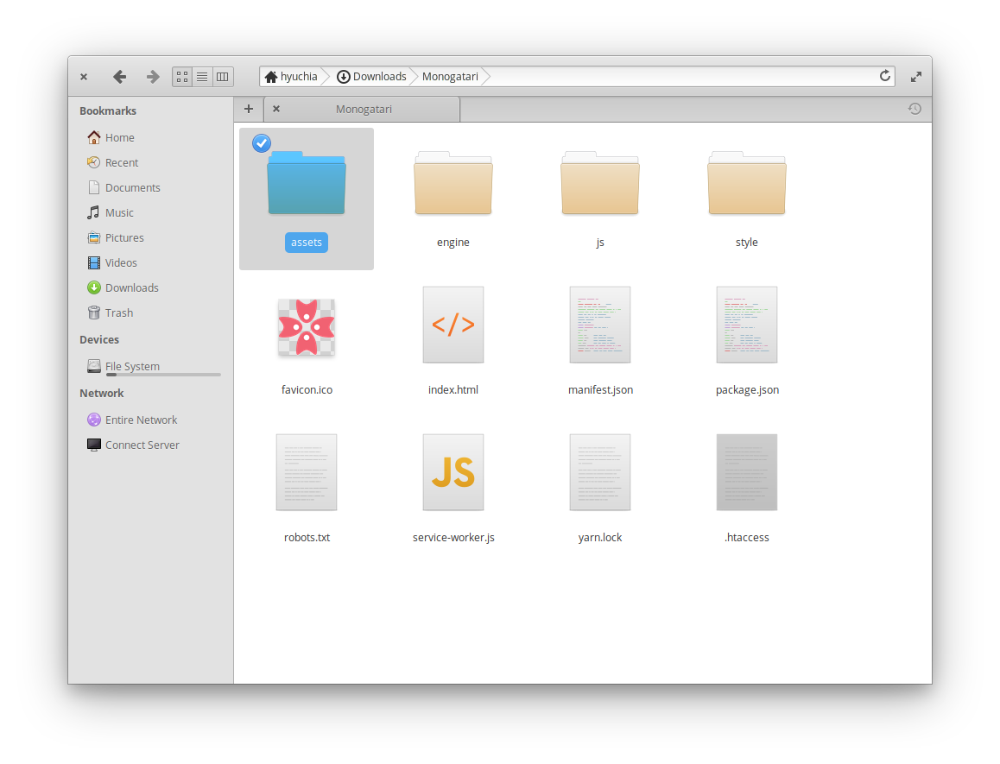
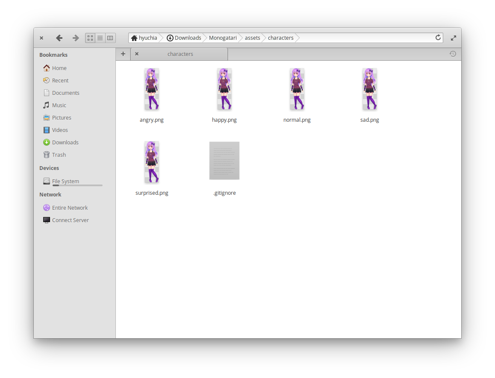
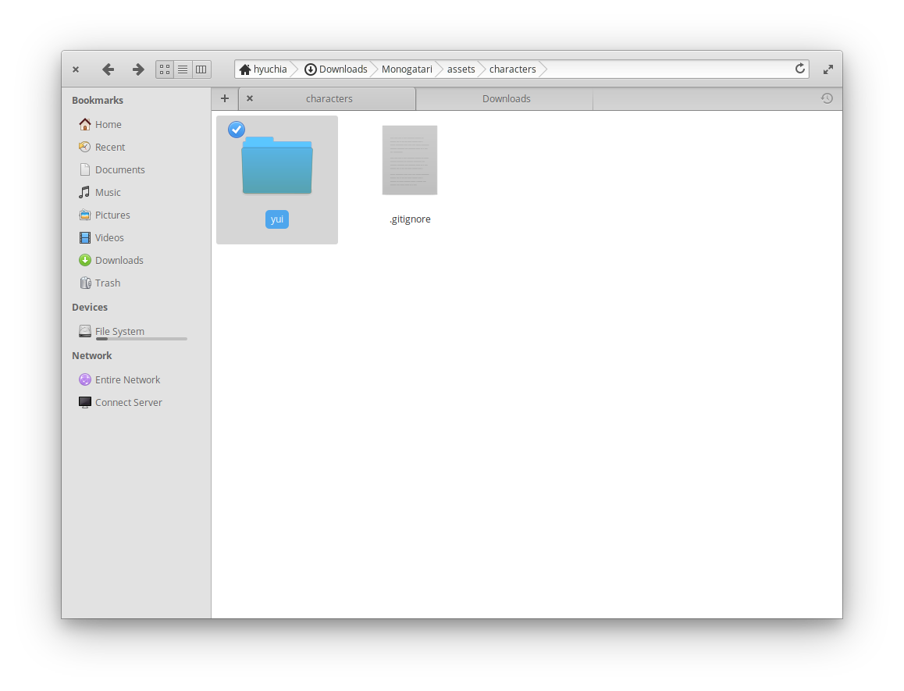
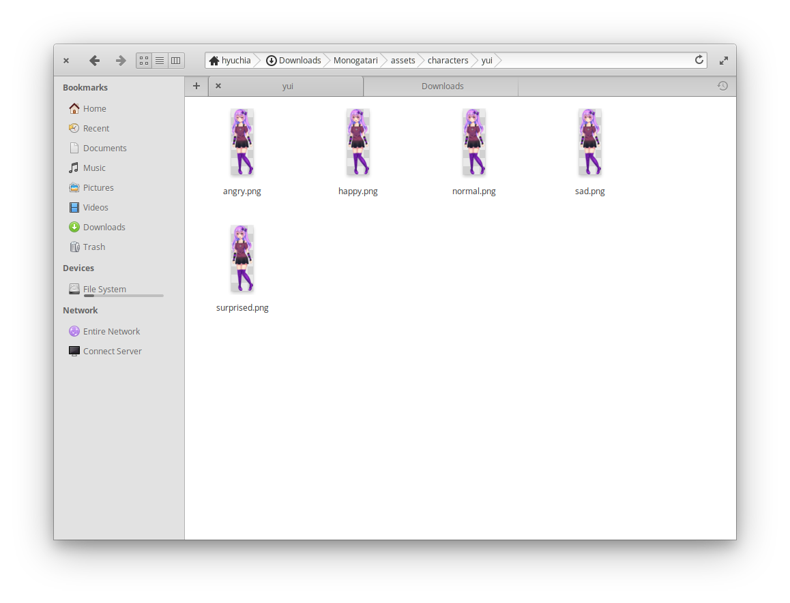
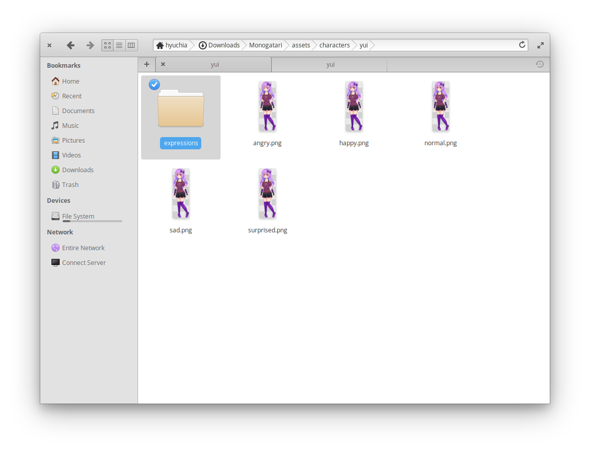
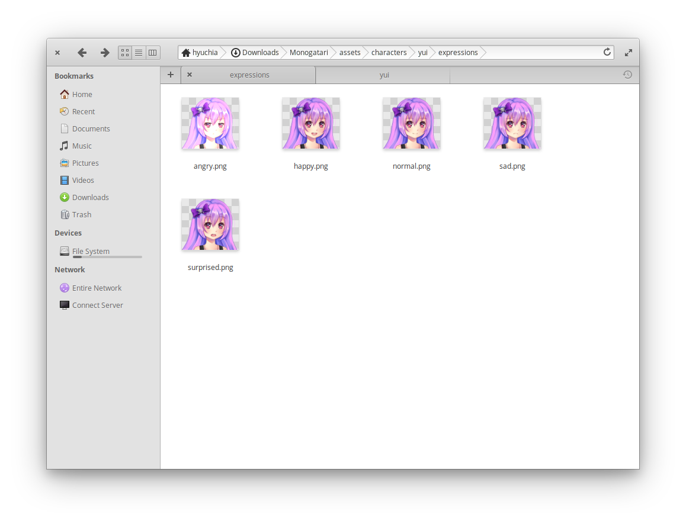

# Characters

## Overview

Characters are probably one of the most important parts of your novel, not only used for displaying them as sprites but also to display their dialogs.

## Properties

The following table lists all the properties you can set for each character.

| Name | Type | Optional | Description |
| :--- | :--- | :--- | :--- |
| `name` | `string` | Yes | The name that will be shown when this character speaks. Supports storage and translation interpolations. |
| `color` | `string` | Yes | A valid [CSS color](https://developer.mozilla.org/en-US/docs/Web/CSS/color) which will be used to color the character's name. |
| `directory` | `string` | Yes | Specifies the sub-directory where the sprites and expressions images for the character are stored in case they are not in the root `assets/characters` directory. |
| `sprites` | `object` | Yes | An object with the identifiers and file names for each [sprite](../script-actions/characters.md) available for the character. |
| `default_expression` | `string` | Yes | Identifier of the expression to show every time the character speaks (must be defined in `expressions`). |
| `expressions` | `object` | Yes | An object with the identifiers and file names for each [side expression](../script-actions/dialogs.md#side-images) available for the character. |
| `nvl` | `boolean` | Yes | Default is `false`. Whether the character's dialogs should be shown in [NVL mode](../script-actions/dialogs.md#nvl-dialogs). |
| `type_animation` | `boolean` | Yes | Default is `true`. Whether the typewriter animation should be used when the character speaks. |
| `layers` | `array` | Yes | **Experimental.** Defines the order of layers from back to front for layered sprites. |
| `layer_assets` | `object` | Yes | **Experimental.** Maps layer names to their available sprite options for layered sprites. |

## Declaration

Declaring characters is really simple.

First, you need to define an identifier. This is what you'll use for the [`dialog`](../script-actions/dialogs.md) and [`show character`](../script-actions/characters.md) actions.

We'll choose the identifier `y`, short for Yui in this tutorial.

```javascript
monogatari.characters ({
    'y': {

    }
});
```

Do you have more than one character? No problem! You can define as many characters as you want, just make sure that each character has a unique identifier.

```javascript
monogatari.characters ({
    'y': {

    },
    'm': {

    }
});
```

We've come up with our identifiers and they point to an empty object. Inside this object is where we'll define each of the properties we need for each character.

## Name and Color

The most basic properties are the name and color for our characters. The name will appear in the textbox every time the character speaks and the color specifies what color that name will be.

```javascript
monogatari.characters ({
    'y': {
        name: 'Yui',
        color: '#00bfff'
    }
});
```

## Character Sprites

Since we are building visual novels, chances are we also need images for our characters.

All your character's sprites should be placed in your `assets/characters` directory, let's see what that looks like.

### 1. Enter the `assets` directory



### 2. Enter the `characters` directory


### 3. Place all your sprite images



### 4. Declare your assets

Now that we have all our sprites in our assets directory, we need to declare them so monogatari knows about them. To do so, we'll use the `sprites` property of our character:

```javascript
monogatari.characters ({
    'y': {
        name: 'Yui',
        color: '#00bfff', 
        sprites: {
            angry: 'normal.png',
            happy: 'happy.png',
            normal: 'normal.png',
            sad: 'sad.png',
            surprised: 'surprised.png'
        }
    }
});
```

Notice how for each sprite we assigned two things:

1. A **key or identifier** which is the way we'll refer to that specific sprite.
2. The name of the file.

```javascript
identifier: 'file.name'
```

Both items are independent of each other so while in the last example we used identifiers similar to the file names, we could have chosen any identifier, the following would be perfectly valid for example:

```javascript
 someKey: 'normal.png'
 happy: 'my_file_name.png'
```

To learn how to show a character sprite, see the [Show Character action](../script-actions/characters.md).

## Custom Sub-directory

In the [Character Sprites](characters.md#character-sprites) section we added all of our character sprite images into the `assets/characters` directory. This approach is pretty straight forward but can become a bit troublesome as you add more characters. For starters, the directory could start feeling cluttered and you would not be able to use the same name on different files without them getting overwritten.

A solution for this issue is to have a different directory for each character where we'll place all the assets for that character alone. This is achieved by specifying the `directory` property in your character declaration. This property expects the name of a sub-directory inside the `assets/characters` directory. For example, if you create a sub-directory `assets/characters/my-character` then you should set the `directory` property to `'my-character'`. Let's take a look at the whole process:

### 1. Create your sub-directory



### 2. Place all your character assets in that sub-directory



### 3. Set the directory property in your declaration

Now that we've created the sub-directory and placed all our assets for a specific character in it, then we must specify the `directory` property in our character so monogatari knows where the files are located.

```javascript
monogatari.characters ({
    'y': {
        name: 'Yui',
        color: '#00bfff',
        directory: 'yui', 
        sprites: {
            angry: 'normal.png',
            happy: 'happy.png',
            normal: 'normal.png',
            sad: 'sad.png',
            surprised: 'surprised.png'
        }
    }
});
```

## Expressions / Side Images

It is also possible to define side images or expressions to show on the textbox when your character speaks.

### 1. Add your expression images to your assets

For this example we'll add all our expressions in their own directory. This is not required though and you can place them right where your character's sprites are.



Now that we've created our `expressions` sub-directory, we'll place all our expression images in it.



### 2. Add the expressions to your declaration

Now that we've added our files, we need to define them in our character declaration by defining the `expressions` property. Just like the `sprites` property, it expects an identifier/filename list.

```javascript
monogatari.characters ({
    'y': {
        name: 'Yui',
        color: '#00bfff',
        directory: 'yui', 
        sprites: {
            angry: 'normal.png',
            happy: 'happy.png',
            normal: 'normal.png',
            sad: 'sad.png',
            surprised: 'surprised.png'
        },
        expressions: {
            angry: 'expressions/normal.png',
            happy: 'expressions/happy.png',
            normal: 'expressions/normal.png',
            sad: 'expressions/sad.png',
            surprised: 'expressions/surprised.png'
        }
    }
});
```

Notice how we added the `expressions/` prefix to all of the file names to account for the `expressions` directory we put the files in. If we hadn't done that and we had placed them right with our sprites, the prefix would not be needed but we would have to change the names of the files so that they don't overlap with the sprites ones.

To learn how to show these expressions in a dialog, see the [Dialog action](../script-actions/dialogs.md).

## Default Expression

It is also possible to define a default side image / expression for your character. This default one will be shown for all of your character's dialogs that do not specify any other expression.

The `default_expression` property expects the identifier of one of your expressions as its value. Previously we defined the `normal` expression for our character:

```javascript
normal: 'expressions/normal.png'
```

If we wanted to make that one the default expression, then we'd need to set the `default_expression` property to `normal`:

```javascript
monogatari.characters ({
    'y': {
        name: 'Yui',
        color: '#00bfff',
        directory: 'yui', 
        sprites: {
            angry: 'normal.png',
            happy: 'happy.png',
            normal: 'normal.png',
            sad: 'sad.png',
            surprised: 'surprised.png'
        },
        expressions: {
            angry: 'expressions/normal.png',
            happy: 'expressions/happy.png',
            normal: 'expressions/normal.png',
            sad: 'expressions/sad.png',
            surprised: 'expressions/surprised.png'
        },
        default_expression: 'normal'
    }
});
```

## NVL Mode

By default, characters will speak in `adv` mode. In ADV mode, the textbox appears in the bottom of the screen and only displays a dialog at a time. NVL mode will make the textbox cover the whole screen and will display several dialogs in a log format.

The `nvl` property accepts a boolean value \(`true` or `false`\) and is **set to `false` by default**. Setting it to `true` will make all of the character's dialogs to be shown in `nvl` mode.

```javascript
monogatari.characters ({
    'y': {
        name: 'Yui',
        color: '#00bfff',
        directory: 'yui', 
        sprites: {
            angry: 'normal.png',
            happy: 'happy.png',
            normal: 'normal.png',
            sad: 'sad.png',
            surprised: 'surprised.png'
        },
        expressions: {
            angry: 'expressions/normal.png',
            happy: 'expressions/happy.png',
            normal: 'expressions/normal.png',
            sad: 'expressions/sad.png',
            surprised: 'expressions/surprised.png'
        },
        default_expression: 'normal',
        nvl: true
    }
});
```

If you want to learn more about the different dialog modes, check the [Dialog action](../script-actions/dialogs.md) and the [Text Box component](../components/text-box.md).

## Typewrite Animation

Monogatari allows you to disable the typewrite animation for your game from your game's settings, however, some times you only want to disable the animation for a specific character.

The `type_animation` property accepts a boolean value \(`true` or `false`\) and is **set to `true` by default**. Setting it to `false` will disable the animation for all of that character's dialogs.

```javascript
monogatari.characters ({
    'y': {
        name: 'Yui',
        color: '#00bfff',
        directory: 'yui', 
        sprites: {
            angry: 'normal.png',
            happy: 'happy.png',
            normal: 'normal.png',
            sad: 'sad.png',
            surprised: 'surprised.png'
        },
        expressions: {
            angry: 'expressions/normal.png',
            happy: 'expressions/happy.png',
            normal: 'expressions/normal.png',
            sad: 'expressions/sad.png',
            surprised: 'expressions/surprised.png'
        },
        default_expression: 'normal',
        nvl: true,
        type_animation: false
    }
});
```

## Experimental: Layered Sprites

> [!WARNING]
> This feature requires `ExperimentalFeatures` to be enabled in your game settings.

For paper-doll style characters where you want to independently control different parts (like outfits, expressions, or accessories), you can use layered sprites.

### Additional Properties for Layers

| Name | Type | Description |
| :--- | :--- | :--- |
| `layers` | `array` | Defines the order of layers from back to front (determines z-index) |
| `layer_assets` | `object` | Maps layer names to their available sprite options |

### Layer Declaration

```javascript
monogatari.characters ({
    'y': {
        name: 'Yui',
        color: '#00bfff',
        directory: 'yui',
        // Define layer order (back to front)
        layers: ['base', 'clothes', 'face', 'accessories'],
        // Define sprites for each layer
        layer_assets: {
            base: {
                body: 'base_body.png'
            },
            clothes: {
                uniform: 'clothes_uniform.png',
                casual: 'clothes_casual.png',
                swimsuit: 'clothes_swimsuit.png'
            },
            face: {
                neutral: 'face_neutral.png',
                happy: 'face_happy.png',
                sad: 'face_sad.png',
                angry: 'face_angry.png'
            },
            accessories: {
                none: '',
                glasses: 'acc_glasses.png',
                hat: 'acc_hat.png'
            }
        },
        // You can still define standard sprites as fallbacks
        sprites: {
            normal: 'normal.png'
        }
    }
});
```

For information on how to control individual layers in your script, see the [Character Layers action](../script-actions/character-layers.md).

