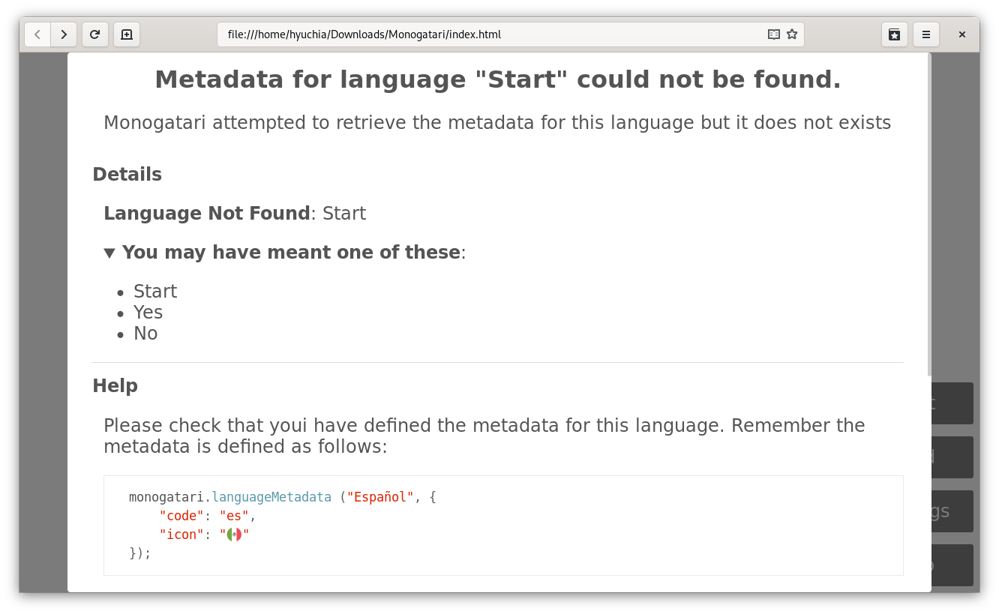
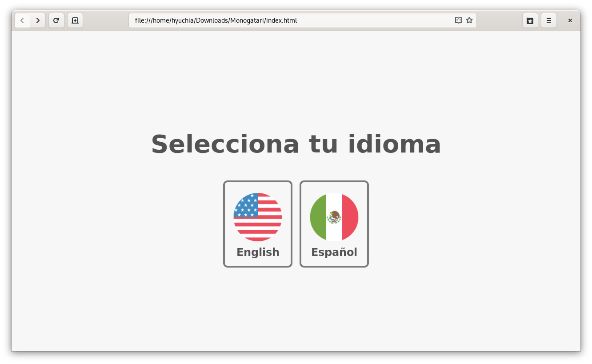
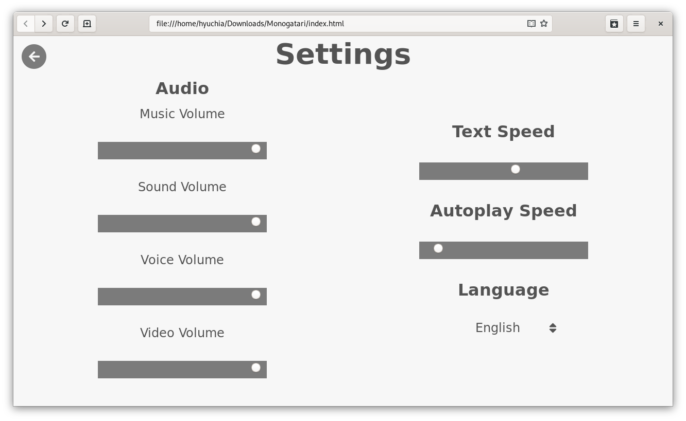
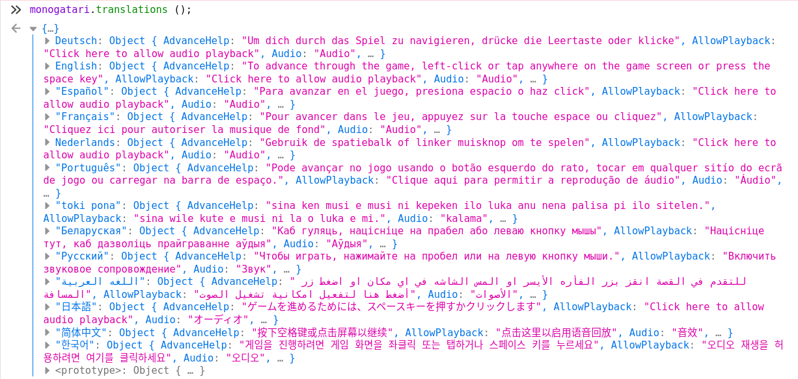
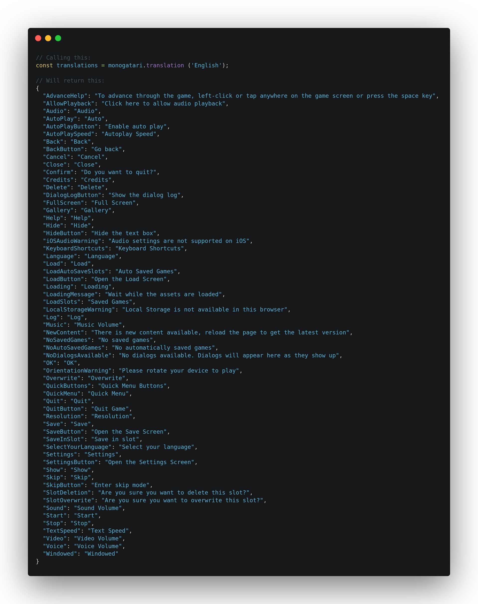

# Internationalization

## Overview

You can create a multi-language game pretty easily. To do so you need to follow these simple steps:

### 1. Enable the `MultiLanguage` setting

Go to the `options.js` file and change the `'MultiLanguage'` value to `true`.

```javascript
	// Change to true for a MultiLanguage GameScreen.
	'MultiLanguage': true,
```

This will let monogatari know that you're planning to have your script in multiple languages. If you reload the page however, you'll most likely get an error like this one:



This is normal and is caused because while we have indicated we would be having multiple versions of our script in multiple languages, we haven't changed the structure of our script to match that.

### 2. Change your Script Format

Next we will be changing the script to support Multi Language games. A single language script as you know is defined as an object with a list of labels and usually looks something like this:

```javascript
monogatari.script ({
    'Start': [
        'Hi, welcome to your first Visual Novel with Monogatari.',
        'jump other'
    ],
    'other': [
        'Another Label!',
        'end'
    ]
});
```

Note how each label is in the top level of the script objects hierarchy. 

A _Multi Language_ script will instead have language objects in the top level and inside of them, the labels of the script that correspond to that language, for example:

```javascript
monogatari.script ({
    'English':{
        'Start': [
            'Hi, welcome to your first Visual Novel with Monogatari.',
            'jump other'
        ],
        'other': [
            'Another Label!',
            'end'
        ]
    },
    'Español':{
        'Start': [
            'Hola, bienvenido a tu primer Novela Visual con Monogatari.',
            'jump other'
        ],
        'other': [
            'Otro label!',
            'end'
        ]
    }
});
```

Note how we essentially duplicated our script inside this new language objects and translated it for each language. 


When saving a game, monogatari saves the `label` and `step` \(index of the statement\) it's currently on. For saved games to be fully compatible with each other, **your different scripts should have the same label names and number of statements in them**, otherwise, a game saved in one language would be invalid if the player changed language again and tried to load it. If you do a [jump](../../script-actions/jump.md) to a label that exists in one translation, but does not exist in the language that the player has selected for example, they will get an error telling them that the label does not exist, so be careful when crafting your script!  
  
In case some differences can't be avoided, you can rely on the [next action](../../script-actions/next.md) to fill act as a filler and make all scripts have the same size. 


If you have your script split in multiple files, you can read more on how to configure internationalization with split files here:



### 3. The Language Selection Screen



Once you've formatted your script correctly, a language selection screen will appear for players that haven't selected a language yet. It will automatically detect the languages in your script and show buttons like the ones shown in the image.


You most likely **won't see this screen** appear to you because you transitioned from a single language game to a _multi language_ one and thus, your settings were already set. 

If you want to trigger this screen, you'll have to remove the settings from your storage using the dev tools.


Players are also able to change their language from the settings screen. The following image shows the language selection setting that appears automatically when a _multi language_ game is configured:



In case you don't want the language selection screen to appear or have built your own, it can be disabled from the options.js file by changing the `LanguageSelectionScreen` property to `false`:

```javascript
// If the 'Multilanguage' setting is set to `true`. This will enable a
	// language selection screen that will be shown before the asset loading
	// screen. If set to false, the loading screen will appear first instead and
	// players will have to change the language from the settings screen.
	'LanguageSelectionScreen': false,
```

### 4. Set the Default Language Preference

Finally, you need to provide a default language for your game. While players will be able to choose their language, monogatari does need something to fall back to. Go to the `options.js` file once more and this time, go to the preferences section in the bottom. There, you should change the `'Language'` property to the name of the language you want to have by default. 

```javascript
// Initial Language for Multilanguage Games or for the Default GUI Language.
'Language': 'Français',
```

## Supported Languages

Monogatari already has built-in support for the following languages:

* `Беларуская`
* `Deutsch`
* `English`
* `Español`
* `Français`
* `Nederlands`
* `Português`
* `Русский`
* `اللغه العربية`
* `한국어`
* `日本語`
* `简体中文`
* `toki pona`

That means UI translations for those languages are available and the full UI will be shown in the correct language. You can also retrieve the list of available translations programmatically using the `monogatari.translations ()` function. This function will return an object with all the available languages and the UI string translations for them.



## Translating the Engine UI for a not-yet-supported language

If you need to translate the game into a language that Monogatari doesn't include in the [supported languages](internationalization.md#supported-languages) or simply want to modify an existing translation, you can define your own UI translations as follows:

```javascript
monogatari.translation ('YourLanguage', {
    'SomeString': 'Your Translation'
});
```

### Adding the UI translations

To make a new language available for your players to choose from, you'll have to add translations for all the strings the UI requires. You can take the [English strings file](https://github.com/Monogatari/Monogatari/blob/develop/src/translations/English.js) as reference so you can gather all the required strings and add your own translations for your language.

You can also get a complete list of every string to translate programmatically by using the `monogatari.translation ('<language_key>')` function, for example:



### Adding the language metadata

Each language also requires some metadata that will be used by monogatari.

| Metadata | Description |
| :--- | :--- |
| `code` | The 2 letter code that represents that language. This code must be a valid [ISO 639-1 code](https://en.wikipedia.org/wiki/List_of_ISO_639-1_codes) since it will be used to format the dates shown on the save slots. |
| `icon` | An emoji that will be shown as the icon for the language in the language selection screen. |

 Here's an example of the definition of a language metadata:

```javascript
monogatari.languageMetadata ('Español', {
    code: 'es', 
    icon: '🇲🇽'
});
```

Once you've setup all the string translations and language metadata, all you need is adding your script for your new language and the option will appear automatically both on the language selection and the settings screens.

