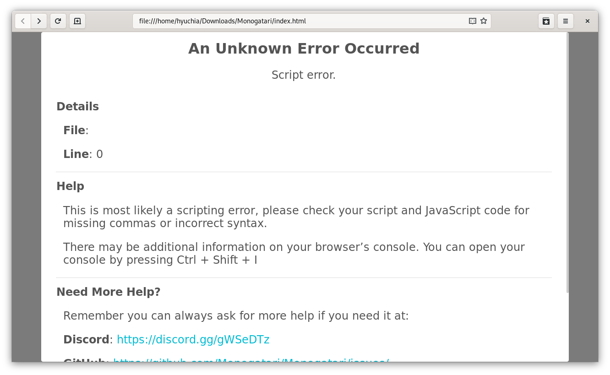

# Diagnosing Errors

## The Browser Developer Tools

The browser's developer tools are your best friend. Learning your way around them will make wonders for you. Here are a few resources you might find useful:

* [What are browser developer tools?](https://developer.mozilla.org/en-US/docs/Learn/Common_questions/What_are_browser_developer_tools)
* [Chrome DevTools](https://developers.google.com/web/tools/chrome-devtools/)

Most importantly when dealing with errors on your novel, the console included on those dev tools is essential. To open your browser dev tools, you can press `Ctrl + Shift + i` or `Command + Shift + i` if you're on a mac. Alternatively, you can right click on the page and choose the `Inspect element` option.

Once the dev tools pop open, select the `Console` tab to see the logs printed by your game.

## Tips for asking for help

We all need some help every once in a while, here is a list of things that will make the experience of asking for help better for everyone and more useful to you!

### Provide as much detail as you can

When asking for help, please provide ALL the necessary information, more often than not you will be asked "what version are you using?" and "please show me your code" when you don't provide that information from the beginning.

#### When dealing with errors:

1. Provide what monogatari version you're using
2. Provide what browser you're using
3. Provide the full error message you're getting, whether from Monogatari or from your browser's console
4. Provide the piece of code / script causing the issue and the surrounding code (at least 5 lines before and after)

#### When dealing with unexpected behaviors

1. Provide what monogatari version you're using
2. Provide what browser you're using
3. Provide the piece of code / script that's not behaving as you expected and the surrounding code (at least 5 lines before and after)
4. Provide a description of what you are attempting to do and what is happening

### Ensure your code is properly indented

If you're sharing code, ensuring it's properly indented will help a lot for the people who's trying to help you out as it will be easier to read and easier to catch what's going on.

#### Badly Indented Code

```javascript
monogatari.script ({
	// The game starts here.
	'Start': [
		'show scene #f7f6f6 with fadeIn',
		'show notification Welcome',
		{
			'Input': {
						'Text': 'What is your name?',
	'Validation': function (input) {
					return input.trim ().length > 0;
		},
			'Save': function (input) {
					this.storage ({
								player: {
							name: input}});
					return true;
				},
				'Revert': function () {
					this.storage ({
						player: {
							name: ''
						}
					});},
	'Warning': 'You must enter a name!'
			}
							},
		'y Hi {{player.name}} Welcome to Monogatari!',
{
			'Choice': { 'Dialog': 'y Have you already read some documentation?',
				'Yes': {
						'Text': 'Yes', 			'Do': 'jump Yes'
				},
				'No': {
					'Text': 'No',
					'Do': 'jump No'
				}
			}
		}
	]
});
```

#### Perfectly Indented Code

```javascript
monogatari.script ({
	// The game starts here.
	'Start': [
		'show scene #f7f6f6 with fadeIn',
		'show notification Welcome',
		{
			'Input': {
				'Text': 'What is your name?',
				'Validation': function (input) {
					return input.trim ().length > 0;
				},
				'Save': function (input) {
					this.storage ({
						player: {
							name: input
						}
					});
					return true;
				},
				'Revert': function () {
					this.storage ({
						player: {
							name: ''
						}
					});
				},
				'Warning': 'You must enter a name!'
			}
		},
		'y Hi {{player.name}} Welcome to Monogatari!',
		{
			'Choice': {
				'Dialog': 'y Have you already read some documentation?',
				'Yes': {
					'Text': 'Yes',
					'Do': 'jump Yes'
				},
				'No': {
					'Text': 'No',
					'Do': 'jump No'
				}
			}
		}
	]
});
```

## Generic errors



When an error unknown to monogatari occurs, you'll get a similar screen to this one. This usually means you have an error on your script. More information about the error like the file and line the error is in will be available in your browser's console. The exact error message varies from browser to browser.

This specific example of an error was caused by the following script:


Paying some attention to it might reveal there's a missing comma after the `show scene` statement.  Going to the browser's console, allowed us to see more information about it.

This is what Firefox showed:


Chrome on the other hand, showed an error a little bit more generic:


They both however, referred to the same line as causing the issue, shown at the end of the error as `script.js:164`.

Our code editor also showed there was an error there, highlighting that same line in red:


So, even if the errors don't exactly scream "You're missing a comma!" back to you, they at least let you know around what line you're having an issue. Paying closer attention to that area will most likely lead you to finding what's the actual error. Other errors have much more specific error messages that will let you know what's the error right away but this one is a good example since it's very common and the messages provided by browsers are not perfect.

### Game Apparently Stuck

If it appears the game is stuck and won't advance anymore no matter how much you click, chances are an error occurred. Check your browser's console to see what's going on. If no information is visible, then try enabling the debug mode.

## Using the Debug Mode

Monogatari has a lot of debug logs that are disabled by default. You can enable them by adding this piece of code to your `main.js` file, right before the `monogatari.init ()` function.

```javascript
monogatari.debug.level (5);
```

Once added, reload the page and open the browser's console, you should see a whole bunch of new things being logged now.

## Common Errors

### Missing Commas

After every statement of your script, there must be a comma unless it is the last statement in the label:

```javascript
monogatari.script ({
	'Start': [
		'show scene #f7f6f6 with fadeIn', // This comma right here
		'Hi!', // This comma right here
		'end'
	]
});
```

A comma must be used to separate different labels in a script:

```javascript
monogatari.script ({
	'Start': [
		'show scene #f7f6f6 with fadeIn',
		'Hi!',
		'jump myLabel'
	], // This comma right here
	'myLabel': [
		'How are you?',
		'end'
	]
});
```

### Incorrectly Closed Labels or Scripts

A script is a JSON object, it must start with a curly brace (`{`) and end with one as well (`}`)

Labels are arrays and as such, they must start with a square bracket (`[`) and end with one (`]`)
