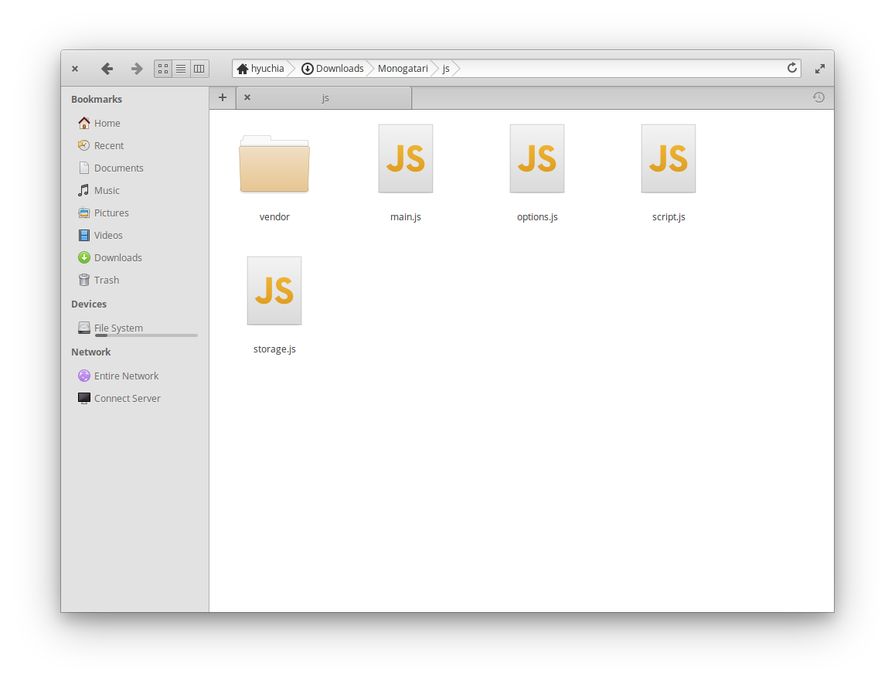
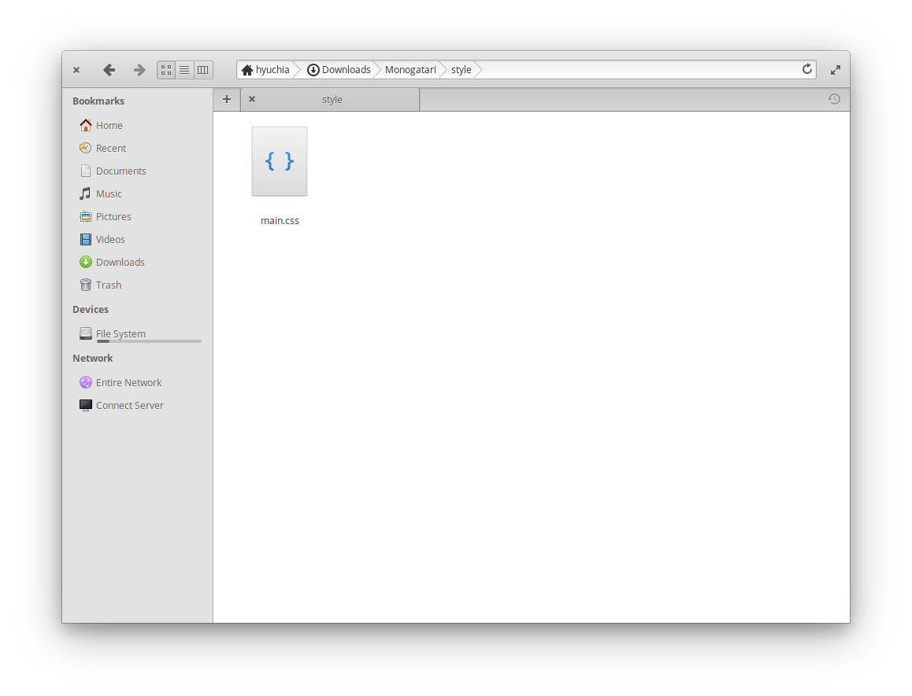

# Step 3: Get Familiarized

Once you've [downloaded the latest Monogatari release](getting-monogatari.md), take some time to get familiar with the files and directories inside it.


You can take a look at a more visual representation of the Monogatari project structure [in this simple mind map](https://www.mindmeister.com/1136161346/monogatari-project-structure).


### Directories

You'll find some directories, here is what you should use them for.

| Directory | Contains                                                                                                       |
| --------- | -------------------------------------------------------------------------------------------------------------- |
| `assets`  | This is where all your assets such as images, audio files, font files etc. should go                           |
| `engine`  | The core engine files that make everything work. Updating Monogatari is as simple as replacing this directory. |
| `js`      | This is where you'll set your game configuration and create your game script.                                  |
| `style`   | CSS files for your project (CSS defines the look and style of your game).                                      |

## **Root Directory**

Inside the main directory you'll find some pretty useful files.

| File                | Contains                                                                                          |
| ------------------- | ------------------------------------------------------------------------------------------------- |
| `index.html`        | This is your main file, open this file in a browser and there's your game!                        |
| `manifest.json`     |                                                                                                   |
| `robots.txt`        | This file asks crawlers and other bots to keep your assets directory unindexed from web searches. |
| `service-worker.js` | This file defines your service worker, used for asset preloading and caching                      |
| `.htaccess`         | This file provides a basic Apache configuration in case you are using that web server.            |

More about what to do and how to use this specific files will come later as you read the documentation.

**JS Directory**

JavaScript is the programming language you'll be using in Monogatari, it is what makes all your game work.

| File           | Contains                                                                                     |
| -------------- | -------------------------------------------------------------------------------------------- |
| **main.js**    | If you want to add more javascript, this is the file to do it!                               |
| **options.js** | Initial settings of your game and engine settings.                                           |
| **script.js**  | The main script of your game. (Here's where your story, characters, images etc are declared) |
| **storage.js** | This is where you'll declare your custom variables that you want to save in your games.      |

**Style Directory**

CSS is the markup language used to style your game, from setting colors to improving the appearance, CSS is what will allow you do them all.&#x20;

| File         | Contains                       |
| ------------ | ------------------------------ |
| **main.css** | Add your styling in this file. |
