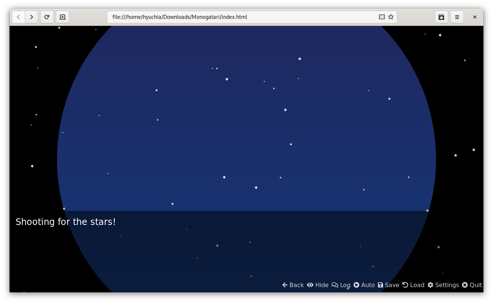

# Show Canvas

## Description

```javascript
'show canvas <object_id> <mode> [with [...classes]]'
```

**Action ID**: Canvas

**Reversible**: Yes

**Requires User Interaction**: Depends on the mode the canvas is displayed on

## Parameters

<table>
  <thead>
    <tr>
      <th style="text-align:left">Name</th>
      <th style="text-align:left">Optional</th>
      <th style="text-align:left">Description</th>
    </tr>
  </thead>
  <tbody>
    <tr>
      <td style="text-align:left"><code>object_id</code>
      </td>
      <td style="text-align:left">No</td>
      <td style="text-align:left">The ID of a canvas object previously defined.</td>
    </tr>
    <tr>
      <td style="text-align:left"><code>mode</code>
      </td>
      <td style="text-align:left">No</td>
      <td style="text-align:left">
        <p>Defines what way you want to show the video like.</p>
        <p></p>
        <p>Possible Values:</p>
        <ul>
          <li><code>modal</code> - Shows the video as a</li>
          <li><code>displayable</code>
          </li>
          <li><code>immersive</code> - Shows the canvas covering the full game screen</li>
          <li><code>background</code> - Shows the canvas as a background for your characters</li>
        </ul>
      </td>
    </tr>
    <tr>
      <td style="text-align:left"><code>...classes</code>
      </td>
      <td style="text-align:left">Yes</td>
      <td style="text-align:left">List of CSS classes to add to the component.</td>
    </tr>
  </tbody>
</table>

## Canvas Objects

```javascript
{
    layers: [],
    props: {},
    state: {},
    start: function (layers, props, state, container) {
        // In here we do everything we need to start
        // our canvas and perform the updates
    },
    stop: function (layers, props, state, container) {
        // Any actions we need to perform to stop the
        // canvas such as canceling animations and
        // freeing resources before the element gets removed
    },
    resize: function (layers, props, state, container) {
        // Perform any actions required when the window
    },
}
```

<table>
  <thead>
    <tr>
      <th style="text-align:left">Property</th>
      <th style="text-align:left">Type</th>
      <th style="text-align:left">Description</th>
    </tr>
  </thead>
  <tbody>
    <tr>
      <td style="text-align:left"><code>layers</code>
      </td>
      <td style="text-align:left"><code>Array&lt;string&gt;</code>
      </td>
      <td style="text-align:left">
        <p>Most of the times, a single canvas HTML element is not enough to represent
          all we require and it may not be efficient either since it would have to
          re-draw all its elements every time we needed to clear it. The layers property
          is a list of strings (names of layers) that you want your canvas to have.
          A HTML canvas element with a <code>data-layer</code> property will be created
          for every layer you list here.</p>
        <p></p>
        <p>If none is provided, a single canvas will be created with a default <code>base</code> layer.</p>
      </td>
    </tr>
    <tr>
      <td style="text-align:left"><code>props</code>
      </td>
      <td style="text-align:left"><code>object</code>
      </td>
      <td style="text-align:left">The props object provides a place to add any static functions or variables
        you might want to share between your object functions. These are properties
        that don&apos;t change throughout the execution of your canvas object.</td>
    </tr>
    <tr>
      <td style="text-align:left"><code>state</code>
      </td>
      <td style="text-align:left"><code>object</code>
      </td>
      <td style="text-align:left">The state object provides a place where you can add any variables you
        wish to share between your object functions. These are properties you expect
        to change throughout the execution of your canvas object.</td>
    </tr>
    <tr>
      <td style="text-align:left"><code>start</code>
      </td>
      <td style="text-align:left"><code>function</code>
      </td>
      <td style="text-align:left">The function that will be called right after the HTML element for the
        canvas is created. In here, you should draw your contents to the layers
        you setup and setup any update required.</td>
    </tr>
    <tr>
      <td style="text-align:left"><code>stop</code>
      </td>
      <td style="text-align:left"><code>function</code>
      </td>
      <td style="text-align:left">This function will be called by the <code>hide canvas</code> action to stop
        and remove your canvas. In here you should cancel any animations and free
        up any resources in use by your canvas.</td>
    </tr>
    <tr>
      <td style="text-align:left"><code>resize</code>
      </td>
      <td style="text-align:left"><code>function</code>
      </td>
      <td style="text-align:left">This functioon will be called every time the window gets resized, it&apos;s
        useful for reacting to this changes by changing your canvas width and height.</td>
    </tr>
  </tbody>
</table>

## Showing as a background



### Defining the Object

The first thing we need to do is create our canvas object, we'll call this one `stars`. 

```javascript
monogatari.action ('Canvas').objects ({
		stars: {
		
		}
});
```

We want two layers for it, one represents the sky and the other one is where the stars will be drawn, therefore, we'll provide these layers to our object:

```javascript
monogatari.action ('Canvas').objects ({
		stars: {
				layers: ['sky', 'stars'],
		}
});
```

Next, we'll define the functions used to draw both the sky and stars in the object's `props` property. We're placing them there because we'll want to re-draw the canvas when the window is resized so having them in a place that we can easily access from both the `start` and `resize` functions would be the best.

```javascript
monogatari.action ('Canvas').objects ({
	stars: {
		layers: ['sky', 'stars'],
		props: {
			drawStar: (ctx, r) => {
				ctx.save();
				ctx.beginPath();
				ctx.moveTo(r, 0);
				for (let i = 0; i < 9; i++) {
					ctx.rotate(Math.PI / 5);
					if (i % 2 === 0) {
						ctx.lineTo((r / 0.525731) * 0.200811, 0);
					} else {
						ctx.lineTo(r, 0);
					}
				}
				ctx.closePath();
				ctx.fill();
				ctx.restore();
			},
			drawSky: (sky) => {
				const width = sky.width;
				const height = sky.height;
				const ctx = sky.getContext('2d');
				ctx.fillRect(0, 0, width, height);
				ctx.translate(width / 2, height / 2);

				// Create a circular clipping path
				ctx.beginPath();
				ctx.arc(0, 0, width * 0.4, 0, Math.PI * 2, true);
				ctx.clip();

				// draw background
				const lingrad = ctx.createLinearGradient(0, -1 * width / 2, 0, height / 2);
				lingrad.addColorStop(0, '#232256');
				lingrad.addColorStop(1, '#143778');

				ctx.fillStyle = lingrad;
				ctx.fillRect(-width/2, -height/2, width, height);
			},
			drawStars: (stars, drawStar) => {
				const width = stars.width;
				const height = stars.height;
				const ctx = stars.getContext('2d');
				// draw stars
				for (var j = 1; j < 50; j++) {
					ctx.save();
					ctx.fillStyle = '#fff';
					ctx.translate(width - Math.floor(Math.random() * width), height - Math.floor(Math.random() * height));
					drawStar(ctx, Math.floor(Math.random() * 4) + 2);
					ctx.restore();
				}
			}
		},
	}
});
```

We're now set to create our `start` function. On it we'll use the functions we added on the props property to actually draw our canvas. This time we didn't provided a `state` object because we don't have any variable that will be changing.

```javascript
monogatari.action ('Canvas').objects ({
	stars: {
		layers: ['sky', 'stars'],
		props: {
			drawStar: (ctx, r) => {
				ctx.save();
				ctx.beginPath();
				ctx.moveTo(r, 0);
				for (let i = 0; i < 9; i++) {
					ctx.rotate(Math.PI / 5);
					if (i % 2 === 0) {
						ctx.lineTo((r / 0.525731) * 0.200811, 0);
					} else {
						ctx.lineTo(r, 0);
					}
				}
				ctx.closePath();
				ctx.fill();
				ctx.restore();
			},
			drawSky: (sky) => {
				const width = sky.width;
				const height = sky.height;
				const ctx = sky.getContext('2d');
				ctx.fillRect(0, 0, width, height);
				ctx.translate(width / 2, height / 2);

				// Create a circular clipping path
				ctx.beginPath();
				ctx.arc(0, 0, width * 0.4, 0, Math.PI * 2, true);
				ctx.clip();

				// draw background
				const lingrad = ctx.createLinearGradient(0, -1 * width / 2, 0, height / 2);
				lingrad.addColorStop(0, '#232256');
				lingrad.addColorStop(1, '#143778');

				ctx.fillStyle = lingrad;
				ctx.fillRect(-width/2, -height/2, width, height);
			},
			drawStars: (stars, drawStar) => {
				const width = stars.width;
				const height = stars.height;
				const ctx = stars.getContext('2d');
				// draw stars
				for (var j = 1; j < 50; j++) {
					ctx.save();
					ctx.fillStyle = '#fff';
					ctx.translate(width - Math.floor(Math.random() * width), height - Math.floor(Math.random() * height));
					drawStar(ctx, Math.floor(Math.random() * 4) + 2);
					ctx.restore();
				}
			}
		},
		start: function ({ sky, stars }, props, state, container) {
			let width = 150;
			let height = 150;

			if (container.props.mode === 'background') {
				width = this.width ();
				height = this.height ();
			}

			sky.width = width;
			sky.height = height;

			stars.width = width;
			stars.height = height;

			props.drawSky (sky);
			props.drawStars (stars, props.drawStar);

			return Promise.resolve ();
		}
});
```

Next, we'll create our `stop` function. On canvas objects that feature animations this is a very important function since all animations need to be canceled. Otherwise, they will drain the memory of the browser even if they're no longer being shown. In this case, we don't have any animations but we'll clear the canvas object completely when stopped.

```javascript
monogatari.action ('Canvas').objects ({
	stars: {
		layers: ['sky', 'stars'],
		props: {
			drawStar: (ctx, r) => {
				ctx.save();
				ctx.beginPath();
				ctx.moveTo(r, 0);
				for (let i = 0; i < 9; i++) {
					ctx.rotate(Math.PI / 5);
					if (i % 2 === 0) {
						ctx.lineTo((r / 0.525731) * 0.200811, 0);
					} else {
						ctx.lineTo(r, 0);
					}
				}
				ctx.closePath();
				ctx.fill();
				ctx.restore();
			},
			drawSky: (sky) => {
				const width = sky.width;
				const height = sky.height;
				const ctx = sky.getContext('2d');
				ctx.fillRect(0, 0, width, height);
				ctx.translate(width / 2, height / 2);

				// Create a circular clipping path
				ctx.beginPath();
				ctx.arc(0, 0, width * 0.4, 0, Math.PI * 2, true);
				ctx.clip();

				// draw background
				const lingrad = ctx.createLinearGradient(0, -1 * width / 2, 0, height / 2);
				lingrad.addColorStop(0, '#232256');
				lingrad.addColorStop(1, '#143778');

				ctx.fillStyle = lingrad;
				ctx.fillRect(-width/2, -height/2, width, height);
			},
			drawStars: (stars, drawStar) => {
				const width = stars.width;
				const height = stars.height;
				const ctx = stars.getContext('2d');
				// draw stars
				for (var j = 1; j < 50; j++) {
					ctx.save();
					ctx.fillStyle = '#fff';
					ctx.translate(width - Math.floor(Math.random() * width), height - Math.floor(Math.random() * height));
					drawStar(ctx, Math.floor(Math.random() * 4) + 2);
					ctx.restore();
				}
			}
		},
		start: function ({ sky, stars }, props, state, container) {
			let width = 150;
			let height = 150;

			if (container.props.mode === 'background') {
				width = this.width ();
				height = this.height ();
			}

			sky.width = width;
			sky.height = height;

			stars.width = width;
			stars.height = height;

			props.drawSky (sky);
			props.drawStars (stars, props.drawStar);

			return Promise.resolve ();
		},
		stop: ({ sky, stars }, props, state, container) => {
			sky.getContext('2d').clearRect (0, 0, sky.width, sky.height);
			stars.getContext('2d').clearRect (0, 0, stars.width, stars.height);
		}
});
```

Finally, since we mentioned we wanted to re-draw our canvas when the window got resized \(to make it always fit the entire screen\), we'll create our `resize` function with code very similar to our `start` function.

```javascript
monogatari.action ('Canvas').objects ({
	stars: {
		layers: ['sky', 'stars'],
		props: {
			drawStar: (ctx, r) => {
				ctx.save();
				ctx.beginPath();
				ctx.moveTo(r, 0);
				for (let i = 0; i < 9; i++) {
					ctx.rotate(Math.PI / 5);
					if (i % 2 === 0) {
						ctx.lineTo((r / 0.525731) * 0.200811, 0);
					} else {
						ctx.lineTo(r, 0);
					}
				}
				ctx.closePath();
				ctx.fill();
				ctx.restore();
			},
			drawSky: (sky) => {
				const width = sky.width;
				const height = sky.height;
				const ctx = sky.getContext('2d');
				ctx.fillRect(0, 0, width, height);
				ctx.translate(width / 2, height / 2);

				// Create a circular clipping path
				ctx.beginPath();
				ctx.arc(0, 0, width * 0.4, 0, Math.PI * 2, true);
				ctx.clip();

				// draw background
				const lingrad = ctx.createLinearGradient(0, -1 * width / 2, 0, height / 2);
				lingrad.addColorStop(0, '#232256');
				lingrad.addColorStop(1, '#143778');

				ctx.fillStyle = lingrad;
				ctx.fillRect(-width/2, -height/2, width, height);
			},
			drawStars: (stars, drawStar) => {
				const width = stars.width;
				const height = stars.height;
				const ctx = stars.getContext('2d');
				// draw stars
				for (var j = 1; j < 50; j++) {
					ctx.save();
					ctx.fillStyle = '#fff';
					ctx.translate(width - Math.floor(Math.random() * width), height - Math.floor(Math.random() * height));
					drawStar(ctx, Math.floor(Math.random() * 4) + 2);
					ctx.restore();
				}
			}
		},
		start: function ({ sky, stars }, props, state, container) {
			let width = 150;
			let height = 150;

			if (container.props.mode === 'background') {
				width = this.width ();
				height = this.height ();
			}

			sky.width = width;
			sky.height = height;

			stars.width = width;
			stars.height = height;

			props.drawSky (sky);
			props.drawStars (stars, props.drawStar);

			return Promise.resolve ();
		},
		stop: ({ sky, stars }, props, state, container) => {
			sky.getContext('2d').clearRect (0, 0, sky.width, sky.height);
			stars.getContext('2d').clearRect (0, 0, stars.width, stars.height);
		},
		resize: function ({ sky, stars }, props, state, container) {
			if (container.props.mode === 'background') {
				const width = this.width ();
				const height = this.height ();

				sky.getContext('2d').clearRect (0, 0, sky.width, sky.height);
				stars.getContext('2d').clearRect (0, 0, stars.width, stars.height);

				sky.width = width;
				sky.height = height;

				stars.width = width;
				stars.height = height;

				props.drawSky (sky);
				props.drawStars (stars, props.drawStar);
			}
		}
	}
});
```

### Using it in our script

Once we've got our canvas object setup, we can go ahead and show it in our game.

```javascript
monogatari.script ({
	// The game starts here.
	'Start': [
		'show canvas stars background with fadeIn',
		'Shooting for the stars!',
		'end'
	]
});
```

