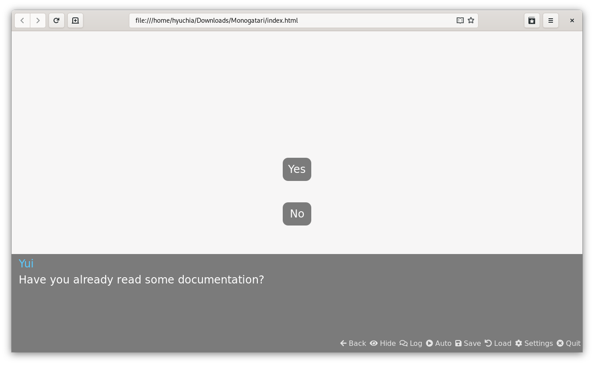

# Choices



## Overview

Choices allow players to take decisions and then react based on whatever they chose. They are represented on your script as `Objects` and they allow you to define as many choices as you can fit on the screen!

## Global Properties

| Name | Type | Optional | Description |
| :--- | :--- | :--- | :--- |
| `Class` | `string` | Yes | A space separated list of classes to add to the choice container. |
| `Dialog` | `string` | Yes | Specifies a dialog to be shown along with the choices. |
| `Timer` | `object` | `yes` | A timer configuration object. |
| `...Choices` | `Objects` | No | Any other object added will be considered as a choice. Choices have their own individual properties that are described below. |

## Choices Properties

| Name | Type | Optional | Description |
| :--- | :--- | :--- | :--- |
| `Class` | `string` | Yes | A space separated list of classes to add to the choice. |
| `Clickable` | `function` | Yes | A function returning a `boolean`, whether the option should allow to be clicked or not, effectively disabling a choice while still showing it if needed. |
| `Condition` | `function` | Yes | A function returning a `boolean`, whether the choice should be shown or not. |
| `Do` | `statement` | No | The action to perform if the the choice is picked. Contrary to the `onChosen` property, this one should be a Monogatari statement, meaning it can be anything you are able to use in your script. |
| `onChosen` | `function` | Yes | A function that will be run if the choice is picked. |
| `onRevert` | `function` | Yes | A function that will revert the actions done on the `onChosen` function of the choice should the player go back. |
| `Text` | `string` | No | The text that will be shown in the choice. |

## Examples

Every choice requires 2 properties: the text to display and what to do when it's clicked.

```javascript
{'Choice': {
    'Developer': {
        'Text': 'I’m a developer.',
        'Do': 'jump Developer'
    },
    'Writer': {
        'Text': 'I’m a writer.',
        'Do': 'jump Writer'
    },
    'Artist': {
        'Text': 'I’m an artist.',
        'Do': 'jump Artist'
    },
    'Player': {
        'Text': 'I’m a Player.',
        'Do': 'jump Player'
    }
}}
```

### Conditional Choices

There are some cases where you would only want to show a choice if certain conditions are met. For this example, let's assume this is your `storage` variable:

```javascript
'use strict';
// Persistent Storage Variable

monogatari.storage ({
    played: false
});
```

As you can see, we added a 'played' variable inside the storage and set its default to `false`. Now, let's see what would happen with the following Choices:

```javascript
{'Choice': {
    'Developer': {
        'Text': 'I’m a developer.',
        'Do': 'jump Developer'
    },
    'Player': {
        'Text': 'I’m a Player.',
        'Do': 'jump Player',
        'Condition': function () {
            return this.storage ('played'); // The 'Player' option will only be shown if this returns true.
        }
    }
}}
```

`'Player'` will only be shown if the `'played'` variable we added is `true`, since we defined it as `false`, then it won't be shown however, if somewhere along the script we were to change that variable to `true` then this choice will be shown.

### Showing Text when Showing the Choices

You might want to show a dialog along with the choices, this is possible using the `Dialog` property inside the object:

```javascript
{'Choice': {
    'Dialog': 'e Before I continue, let me ask you, what are you?',
    'Developer': {
        'Text': 'I’m a developer.',
        'Do': 'jump Developer'
    },
    'Player':{
        'Text': 'I’m a Player.',
        'Do': 'jump Player',
        'Condition': function () {
            return this.storage ('played'); // The 'Player' option will only be shown if this returns true.
        }
    }
}}
```

That way the `'Dialog'` property is the one that will be shown with the choices, as you can see, just like with normal dialogs, you can specify what character is the one talking and take full advantage of other things like side images on it.

### Unclickable Choices

Earlier we made a conditional choice that would only be shown if a condition was satisfied, but what if you want to show the player that there is a choice they _could_ be making if certain conditions were satisfied.

For this example, let's assume this is your `storage` variable:

```javascript
'use strict';
// Persistent Storage Variable
monogatari.storage ({
    haveKey: false
});
```

As you can see, we added a `haveKey` variable inside the storage and set its default value to `false`. With that established, consider the following code.

```javascript
{'Choice':{
    'Dialog': 'Do you unlock the locked door?',
    'FirstOption':{
        'Text': 'Yes',
        'Do': 'jump label1',
        'Clickable': function(){
            return this.storage().haveKey
        }
},
    'SecondOption':{
        'Text': 'No',
        'Do': 'jump label2'
    }
}},
```

The `'Clickable'` property, as its name implies, decides whether or not a button can be clicked.

`Yes` will be shown regardless of whether or not the variable we added is `true`, but it will only be _clickable_ if it is. On that note, if the variable `haveKey` is false, then the `Yes` button will not be clickable. However, this might be confusing to your players, as they will see a choice, try to click it, and clicking it will do nothing. We can help out with this confusion with a little bit of visual design.

### Styling your Buttons

The `'Class'` property allows you to give a CSS class to your buttons for special styles. Suppose you had the following CSS in your `main.css` file:

```css
.boldedText {
    font-weight: bold;
}
.italicText {
    font-style: italic;
}
```

The `boldedText` and `italicText` classes can then be applied to your buttons by setting their `'Class'` properties in your script, like so:

```javascript
{"Choice":{
    "FirstOption":{
        "Text": "Yes",
        "Do": "jump label1",
        "Class": "boldedText" //A css class to apply to the button.
},
    "SecondOption":{
        "Text": "No",
        "Do": "jump label2",
        "Class": "italicText"
    }
}},
```

This way, the `'Yes'` button will have its text **bolded** and the `'No'` button will have its text _italicized_. You can also use CSS styling to do things like give buttons background images and make the text on them invisible, so you can have buttons with pictures!

Earlier, we mentioned you could style unclickable buttons as well. This is easy to do as the buttons in Monogatari's choices are HTML buttons, and when a button is made unclickable, it is given the `'disabled'` attribute. This means that we can style disabled buttons with CSS attribute styling. Consider the following example:

```css
[disabled] {
    opacity: .5;
}
```

With this CSS styling, buttons containing the `'disabled'` attribute will render semi-transparent, which will visually indicate to the player that they are different, so hopefully they won't be confused when they are unable to click it.

You can also use classes and attributes at the same time:

```css
[disabled].classname {
    text-decoration: line-through;
}
```

In this example, the text would have a line through it if and only if it is both disabled, and the button has the `'.classname'` class. If you wanted to make a specific class for a specific button, you could use the `::after` pseudo selector and the `'content'` property to append an explanation as to why you can't click the button too, or you could make two separate buttons where one displays if a condition is met, and the other displays if the condition is unmet.

### onChosen Functions

The `'onChosen'` property allows us to run a function when the player clicks your button. For this example, we'll assume that our storage contains the following:

```javascript
'use strict';
// Persistent Storage Variable

monogatari.storage ({
    enemyHealth: 100,
    playerAttack: 20
});
```

In our `script.js` file, somewhere _outside_ of our game's script, we could have a simple example function for attacking the enemy.

```javascript
function attackEnemy(){
    monogatari.storage().enemyHealth = monogatari.storage().enemyHealth - monogatari.storage().playerAttack
    };
```

This function sets the `enemyHealth` value to be equal to its current value minus the `playerAttack` value.

Then, in our script, we could have a choice for the player:

```javascript
{"Choice":{
    "Dialog": "The enemy wants to fight! What do you do?",
    "FirstOption":{
        "Text": "Attack!",
        "onChosen": function(){attackEnemy()},
        "Do": "You attack the enemy for {{playerAttack}} damage!"
},
    "SecondOption":{
        "Text": "Defend",
        "Do": "You defend instead of attacking."
    }
}},
"The enemy now has {{enemyHealth}} health points left."
```

You could also have the function written out in the script itself for one-time functions that won't be called again.

```javascript
{"Choice":{
    "Dialog": "The enemy wants to fight! What do you do?",
    "FirstOption":{
        "Text": "Attack!",
        "onChosen": function (){
             monogatari.storage().enemyHealth = 
             monogatari.storage().enemyHealth - monogatari.storage().playerAttack
        },
        "Do": "You attack the enemy for {{playerAttack}} damage!"
},
    "SecondOption":{
        "Text": "Defend",
        "Do": "You defend instead of attacking."
    }
}},
"The enemy now has {{enemyHealth}} health points left.",
```

This achieves the same result. You could also use these functions to invisibly keep track of which options the player clicked, or any other ideas you might have.

### onRevert

The `'onRevert'` property should contain a function that will run when the player rewinds the game using the `back` button before a choice selection that runs an `onChosen` function. Ideally, this function should be used to undo whatever was done by the `onChosen` function, assuming the `onChosen` function did anything at all. For example, if you have an `onChosen` function that gives the player 5 gold, then the `onRevert` function should remove 5 gold, or else the player could just choose the option, rewind, choose it again, until they have as much gold as they want.

```javascript
{"Choice":{
    "Dialog": "Would you like some Gold?",
    "Yes": {
        "Text": "Yes please.",
        "Do": "p Yes please.",
        "onChosen": function() {
            monogatari.storage().playerGold += 5;
        },
        "onRevert": function() {
            monogatari.storage().playerGold -= 5;
        }
    },
    "No": {
        "Text": "No thank you.",
        "Do": "No thank you.",
    },
}},
"Okay! As a result of your decision, you now have {{playerGold}} Gold!",
```

Monogatari remembers for the player which option they picked, so if they chose Yes in the above example, when they rewind, it will run the `onRevert` function for "yes", whereas if they chose no, it will not run anything special, as No does not contain an `onRevert` or `onChosen` function.

The `'onRevert'` property is required when you use the `onChosen` function, or else the player will not be able to use the "back" button to revert before the choice. If you don't care whether or not your player is allowed to rewind before a decision, then you don't need to use `onRevert` but that might make your player assume that there's a bug if some choices are reversible and others aren't.

### Timers

The Timer object takes two methods: "time" and "callback". Time is simply the amount of time in miliseconds you want the timer to last, and callback is a function to run after that timer has finished.

Timers can be used to require the player to think quickly, and make something happen if they take too long to select a choice. In this example, assume that we have a css class "Invisible" that simply applies a `display:none` to the element.

```javascript
{'Choice': {
		'Dialog': 'y Have you already read some documentation?',
		'Timer': {
			// Time in milliseconds 
			time: 5000,
			// The function to run when the time is over
			callback: () => {
				//Click the "tookTooLong" button.
				monogatari.element().find('[data-choice="tookTooLong"]').get(0).click();
				
		// Promise friendly!
				return Promise.resolve ();
			}
		},
		'Yes': {
			'Text': 'Yes',
			'Do': 'jump Yes'
		},
		'No': {
			'Text': 'No',
			'Do': 'jump No'
		},
		'tookTooLong':{
			'Text': 'TookTooLong',
			'Do': 'jump tookTooLong',
			'Class': 'invisible',
		}
	}
},
```

In this example, there are three buttons, but only two of them are actually visible to the player. After 5 seconds passes, the third button is clicked automatically.

You can also do other things with timers, such as increment a counter, play a sound, or anything else you like. Please note, however, that there is no corresponding revert function for timers. Anything that happens in a timer will not be undone when the player clicks the back button. \(Of course, you'd probably not want the player to be able to undo a mistake like allowing a timer to conclude, so if you use timers in this way, consider [disabling the rollback function.](https://community.monogatari.io/d/10-how-to-disable-the-rollback-function)\)


