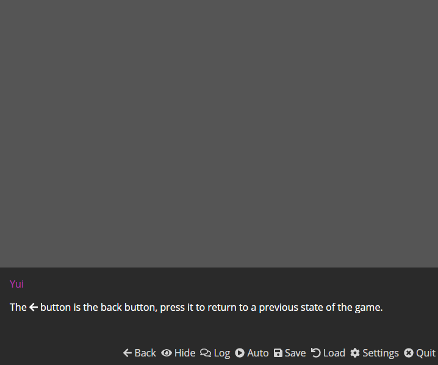

# Dialogs

## Description

```javascript
'[character_id][:[expression_id]] <dialog_text>'
```

### Show Text

The say statement is used... well, for a character to say something. The syntax is as follows:

'\[Character Identifier\] \[Text to Say\]'

```javascript
'y Hi! My name is Yui.'
```


It also accepts HTML, so you can show many things in a text like the Font Awesome icons.

```javascript
'y The <span class="fa fa-arrow-left"></span> button is the back button, press it to return to a previous state of the game.'
```



If no character identifier is given, it will be considered as a narration and no name will be shown.

```javascript
'This would be a narrator.'
```


### Clear the Text

The `'clear'` command sends an empty line of dialog to remove all text on the screen.

```javascript
'clear'
```

The clear command automatically runs the next line without requiring a click from the player. You may want to insert a `'wait'` command immediately after it if you want the player to see a blank dialog box.

### Side Images

If you've defined the `expressions` property for your characters, adding a list of images to show, you can use them as side images with each dialog, to do so, you should use a format like this one:

```javascript
'y:Smiling Hi! My name is Yui.'
```


This assumes you have a Side image called Smiling, which means with every dialog you can specify what side image to use. If you add the `'expression'` property then that image will be shown with every dialog without the need of specifying it inside the statement.

## Centered Dialogs

The `'centered'` command is like a special character-id that goes at the beginning of dialog text to display a special floating box that hovers in the very center of the screen.

```javascript
'centered This is an example of centered text.'
```


The text box that displays `'centered'` text is special. Rather than being inside of a `<text-box>` tag, it is instead inside of a `<centered-dialog>` tag.

```markup
<centered-dialog class="animated" data-component="centered-dialog">
            <div data-content="wrapper">Here's some more centered text.</div>
        </centered-dialog>
```

While `'centered'` text is visible on screen, the main `<text-box>` is hidden with a CSS `display:none;` attribute.

HTML can be used inside of `'centered'` text the same as normal dialog, so you can use this to display a special image that removes the text box when it displays it, or something similar, if you want to get creative!

## NVL Dialogs

The `'nvl'` command is similar to the `'centered'` command in that it is used at the beginning of a line of dialog to present a special display, similar to games like Fate/stay Night, or Radical Dreamers.

```javascript
'nvl Here is an example of NVL text.',
'nvl Here is some more NVL text.',
'nvl One more line.'
```


The `'nvl'` text differs from normal Monogatari text in that clicking does not clear the current text off of the screen, and instead leaves it there, feeding consecutive NVL dialogue one at a time as the player clicks to progress.

NVL text is displayed on screen inside of a `<text-box>` with a CSS class`'nvl'`. By default, this textbox is styled to fill the entire screen. Additionally, each line of NVL text is contained inside of a `<div>` with a `data-spoken` value for whichever character is speaking. Normally it's the narrator, but if you give a character the `nvl` attribute and set it to `true` then that character can be used as an NVL character, and their text can have special CSS rules if you want to get creative with that.


Note that Expression side images are not supported in NVL mode.

The NVL mode text box is scrollable, like other text boxes in Monogatari, should there be too much text to display at once. Additionally, you can use HTML in NVL mode the same as all of the other modes!

