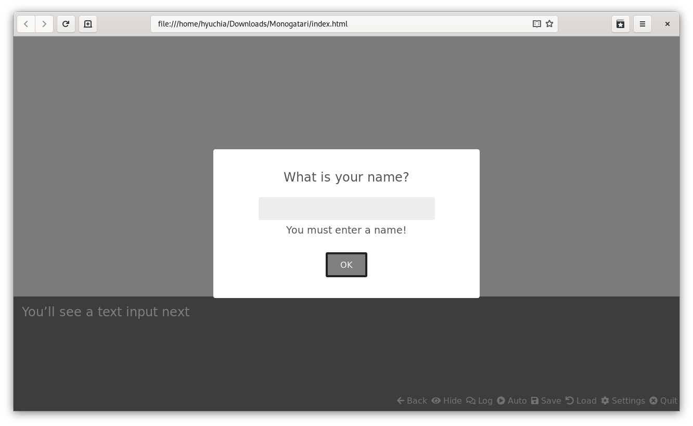
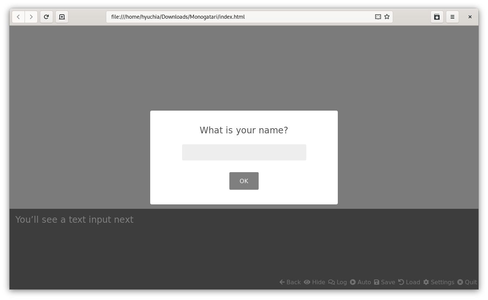
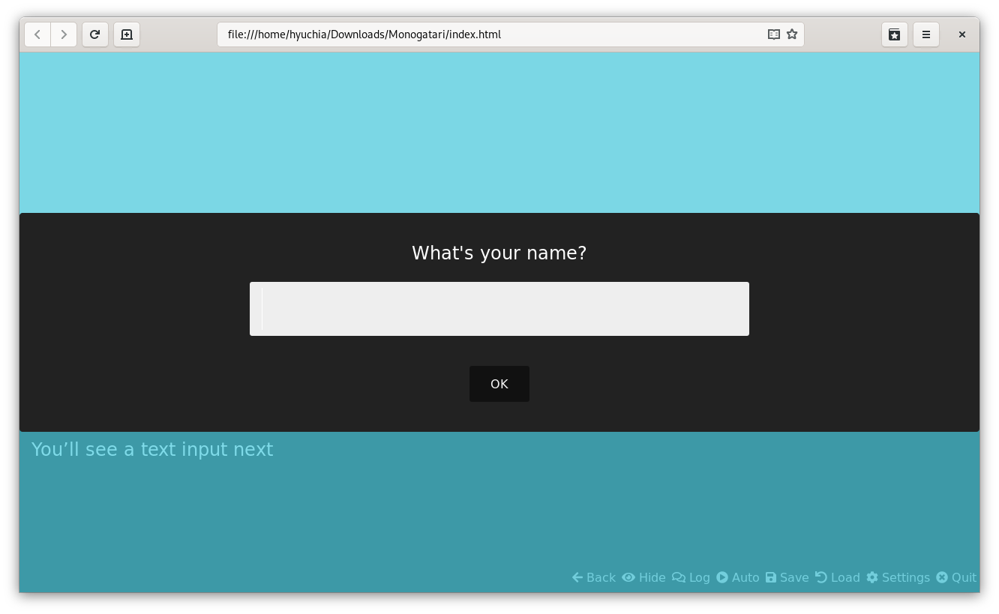
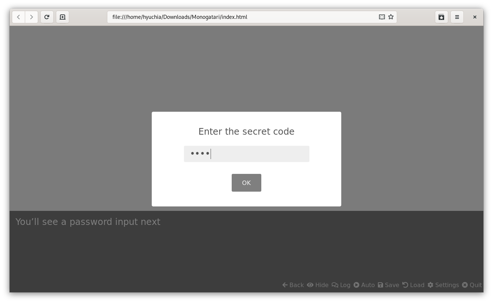
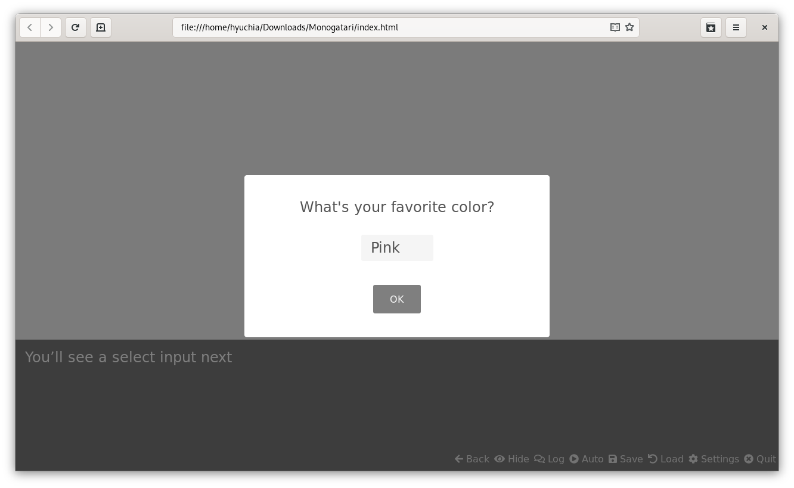
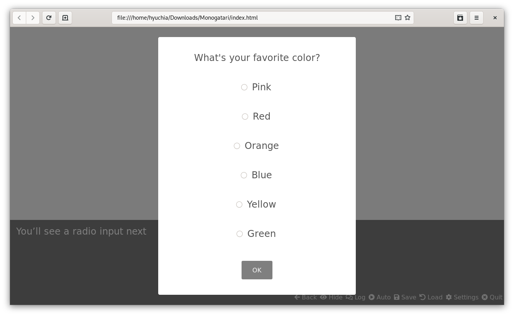
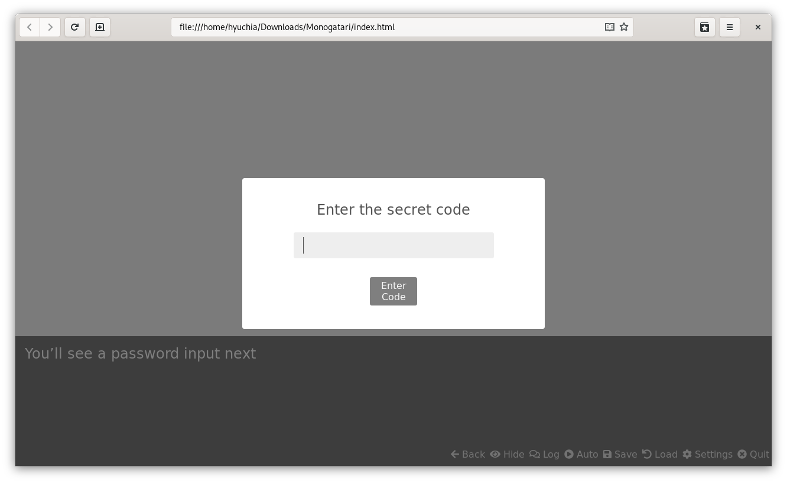

# Input

## Description

There are many cases where we need input from the user, like when you want to know their name. The Input statement is represented in your Script as an Object and it allows you to define the text to show to your players, the type of input, the default value, validations, etc.

**Action ID**: `Input`

**Reversible**: Yes, as long as a [`Revert` function](input.md#input-revert) is implemented.

**Requires User Interaction**: Yes

## Properties

<table>
  <thead>
    <tr>
      <th style="text-align:left">Name</th>
      <th style="text-align:left">Type</th>
      <th style="text-align:left">Optional</th>
      <th style="text-align:left">Description</th>
    </tr>
  </thead>
  <tbody>
    <tr>
      <td style="text-align:left"><code>Text</code>
      </td>
      <td style="text-align:left"><code>string</code>
      </td>
      <td style="text-align:left">No</td>
      <td style="text-align:left">
        <p>The text to be displayed in the input dialog.</p>
        <p>Supports storage and translation interpolations.</p>
      </td>
    </tr>
    <tr>
      <td style="text-align:left"><code>Type</code>
      </td>
      <td style="text-align:left"><code>string</code>
      </td>
      <td style="text-align:left">Yes</td>
      <td style="text-align:left">
        <p>Default is <code>text</code>.</p>
        <p>The kind of input you want to show.</p>
        <p>Possible Values:</p>
        <ul>
          <li><code>text</code>
          </li>
          <li><code>number</code>
          </li>
          <li><code>password</code>
          </li>
          <li><code>email</code>
          </li>
          <li><code>color</code>
          </li>
          <li><code>select</code>
          </li>
          <li><code>radio</code>
          </li>
          <li><code>checkbox</code>
          </li>
        </ul>
      </td>
    </tr>
    <tr>
      <td style="text-align:left"><code>Default</code>
      </td>
      <td style="text-align:left"><code>string</code>
      </td>
      <td style="text-align:left">Yes</td>
      <td style="text-align:left">
        <p>The default value for the input.</p>
        <p>Supports storage and translation interpolations.</p>
      </td>
    </tr>
    <tr>
      <td style="text-align:left"><code>Options</code>
      </td>
      <td style="text-align:left"><code>Array&lt;object&gt;</code>
      </td>
      <td style="text-align:left">Yes</td>
      <td style="text-align:left">
        <p>The list of options to present to the player if the input has a type of
          select, radio or checkbox<b>.</b>
        </p>
        <p>&lt;b&gt;&lt;/b&gt;</p>
        <p>Both the label and value properties in the options support storage and
          translation interpolations.</p>
      </td>
    </tr>
    <tr>
      <td style="text-align:left"><code>Validation</code>
      </td>
      <td style="text-align:left"><code>function</code>
      </td>
      <td style="text-align:left">Yes</td>
      <td style="text-align:left">There are times when you want to validate the user input, to see if it&apos;s
        not empty for example, the Validation property should be a function returning
        a boolean, the validation process is up to what you want. This example
        checks to see if it is empty, but you might put in if trees to disable
        certain names, or something like that.</td>
    </tr>
    <tr>
      <td style="text-align:left"><code>Save</code>
      </td>
      <td style="text-align:left"><code>function</code>
      </td>
      <td style="text-align:left">Yes</td>
      <td style="text-align:left">The save function specifies Monogatari will do with the input once it&apos;s
        validated, normally you would save it on storage, but you can do whatever
        you want with it, the save property is then a function that receives the
        input, what you do with it is also up to you.</td>
    </tr>
    <tr>
      <td style="text-align:left"><code>Warning</code>
      </td>
      <td style="text-align:left"><code>string</code>
      </td>
      <td style="text-align:left">Yes</td>
      <td style="text-align:left">
        <p>The message that will be shown in case the input fails the validation,
          something useful for the player to know what you expect from them.</p>
        <p>Supports storage and translation interpolations.</p>
      </td>
    </tr>
    <tr>
      <td style="text-align:left"><code>actionString</code>
      </td>
      <td style="text-align:left"><code>string</code>
      </td>
      <td style="text-align:left">Yes</td>
      <td style="text-align:left">
        <p>Default is <code>&apos;OK&apos;.</code>
        </p>
        <p>The Key of a translation string that contains the text to show in the
          submit button of the element.</p>
      </td>
    </tr>
    <tr>
      <td style="text-align:left"><code>Class</code>
      </td>
      <td style="text-align:left"><code>string</code>
      </td>
      <td style="text-align:left">Yes</td>
      <td style="text-align:left">A space separated list of CSS class names to apply to the input element.</td>
    </tr>
    <tr>
      <td style="text-align:left"><code>Timer</code>
      </td>
      <td style="text-align:left"><code>object</code>
      </td>
      <td style="text-align:left">Yes</td>
      <td style="text-align:left">A timer configuration object.</td>
    </tr>
    <tr>
      <td style="text-align:left"><code>Attributes</code>
      </td>
      <td style="text-align:left"><code>object</code>
      </td>
      <td style="text-align:left">Yes</td>
      <td style="text-align:left">The list of attributes to add to the <code>input</code> HTML element created.</td>
    </tr>
  </tbody>
</table>

## Input Text

The `Text` property specifies the text that will appear to the player in the input dialog. This is the only property that is required.

## Input Validation

The `Validation` property expects a function. When the player presses the submit button in your input dialog, the value they provided will be passed to your `Validation` function. In there, you can perform any validation you need depending on your game's context and what was the purpose of your input. The function should return a boolean value \(`true` or `false`\) to indicate if the value was valid or not. If your validation has to perform some asynchronous operations such as consulting with an external server, then you can also return a [`Promise`](https://developer.mozilla.org/en-US/docs/Web/JavaScript/Reference/Global_Objects/Promise) that resolves to the boolean value.

If the validation fails, the [input's warning](input.md#input-warning) will be shown to the player.

### Synchronous Validation

Let's take a look at the following input, by default an input that doesn't specifies a `Type` property has the `text` type so it expects the player to type something into a text field:

```javascript
{'Input': {
    'Text': 'What is your name?',
    'Validation': (input) => {
        return input.trim ().length > 0;
    },
    'Save': (input) => {
        monogatari.storage ({ player: { name: input }});
    },
    'Revert': () => {
        monogatari.storage ({ player: { name: '' }});
    },
    'Warning': 'You must enter a name!'
}},
```

As you can see, we have provided a simple validation function there:

```javascript
(input) => {
    return input.trim ().length > 0;
}
```

This function is receiving the player's `input` and then, checks if that input is valid by checking if it has a length greater than 0 or, in simpler words, whether it received a non-empty input which could happen if the player didn't type anything and just pressed the submit button.

By returning the result of that validation, it will return `true` when the input is not empty and `false` when the input is empty. Our code doesn't deal with any [asynchronous function](https://developer.mozilla.org/en-US/docs/Learn/JavaScript/Asynchronous) so we can just return a boolean value this time.

### Asynchronous Validation

There may come a time when for some reason, you want some complex validation to be perform on an input's value. For example, when you have to check with a server to determine whether it's valid or not.

Let's say we have a server setup that given a name, it will returns us an object like this one based on some requirements we have, for example whether it's a full name \(name and last name\) or not.

```javascript
{ valid: true } // When the name is valid
{ valid: false } // When the name is not valid
```

Now, checking with our server is not an operation that we can know how much it'll take to finish so, we want to wait for it to return us the result and only then, we can determine in our game if it was actually valid or not. Here's a sample code on how we could achieve that:

```javascript
{'Input': {
    'Text': 'What is your name?',
    'Validation': (input) => {
        if (input.trim ().length === 0) {
            return false;
        }
        return fetch (`https://myserver.com/api/validate?name=${input}`)
            .then ((response) => {
                return response.json ();
            }).then (({ valid }) => {
                return Promise.resolve (valid);
            });
    },
    'Save': (input) => {
        monogatari.storage ({ player: { name: input }});
    },
    'Revert': () => {
        monogatari.storage ({ player: { name: '' }});
    },
    'Warning': 'You must enter a name!'
}},
```

Let's pay closer attention to our validation function this time:

```javascript
(input) => {
    if (input.trim ().length === 0) {
        return false;
    }
    return fetch (`https://myserver.com/api/validate?name=${input}`)
        .then ((response) => {
            return response.json ();
        }).then (({ valid }) => {
            return Promise.resolve (valid);
        });
}
```

As you can see, we first did a simple check to determine if the input wasn't empty \(`length 0`\) because if it was, we can tell right away it wasn't a valid name and there's no need to check with our server so we make an early `return` if that's the case.

If the input was not empty, we perform the call to our server which should return us the object we discussed before letting us know if the name was valid or not. Once we receive that object, we can finally tell our validation function to return that `Promise.resolve (valid)` value which in the end, contains the valid property returned to us by the server.

## Input Warning

The `Warning` property expects a `string` value that will be shown to the player if the validation function determines the input was invalid.

Keeping the name example from before, this input will validate the value provided by checking if it wasn't empty:

```javascript
{'Input': {
    'Text': 'What is your name?',
    'Validation': (input) => {
        return input.trim ().length > 0;
    },
    'Save': (input) => {
        monogatari.storage ({ player: { name: input }});
    },
    'Revert': () => {
        monogatari.storage ({ player: { name: '' }});
    },
    'Warning': 'You must enter a name!'
}}
```

If the player provided an empty value \(thus causing the validation function to deem it invalid\), the text in the `Warning` property will be shown to the player so they know something was wrong with the info they provided and try again:



## Input Save

Once the `Validation` function is run and it determines the input was valid, the value will be passed along to the `Save` function. Inputs were created mostly to get information out of the player so the `Save` function is where you would, as it name says, save that information or perform any other action you need to do now that you know what the player provided is valid.

Normally this operation would involve some variable in your game's storage:

```javascript
{'Input': {
    'Text': 'What is your name?',
    'Validation': (input) => {
        if (input.trim ().length === 0) {
            return false;
        }
        return fetch (`https://myserver.com/api/validate?name=${input}`)
            .then ((response) => {
                return response.json ();
            }).then (({ valid }) => {
                return Promise.resolve (valid);
            });
    },
    'Save': (input) => {
        monogatari.storage ({ player: { name: input }});
    },
    'Revert': () => {
        monogatari.storage ({ player: { name: '' }});
    },
    'Warning': 'You must enter a name!'
}},
```

If we take a closer look to the `Save` function, we can see it's saving the player's input in the player.name property on the storage:

```javascript
(input) => {
    monogatari.storage ({ player: { name: input }});
}
```

### Changing the game flow

Something really important to know about this function is that the value it returns will affect the flow of the game. If the value returns `void` \(nothing like the one above\) or `true`, the game will continue to the next statement on the script as soon as the save operation finishes. If it returns `false`, then the input dialog will disappear but the player will have to click once more for the game to carry on.

Just like the [Validation function](input.md#input-validation), this one is also able to perform asynchronous operations and the flow will be affected by what the [Promise](https://developer.mozilla.org/en-US/docs/Web/JavaScript/Reference/Global_Objects/Promise) it returns resolves to.

## Input Revert

You probably want players to be able to go back and enter a different value or simply go back to any point of the script even if that means passing through a previously answered input statement.

In order to do so, you need to provide a `Revert` function. This function should be implemented by you and should do everything that's needed to revert what you did in your `Save` function. Let's take the following input as an example:

```javascript
{'Input': {
    'Text': 'What is your name?',
    'Validation': (input) => {
        return input.trim ().length > 0;
    },
    'Save': (input) => {
        monogatari.storage ({ player: { name: input }});
    },
    'Revert': () => {
        monogatari.storage ({ player: { name: '' }});
    },
    'Warning': 'You must enter a name!'
}}
```

In the `Save` function, we're saving the player's name to the storage:

```javascript
'Save': (input) => {
    monogatari.storage ({ player: { name: input }});
}
```

Therefore, what we need to do in our `Revert` function is return that value in the storage to its original or default value:

```javascript
'Revert': () => {
    monogatari.storage ({ player: { name: '' }});
}
```

That way, whenever the player rolls back an input, the state of your game gets reset to what it was before. If you do not provide a `Revert` function however, players won't be able to go back when reaching an input statement, you can of course use this fact to your advantage if that's the behaviour you want, otherwise we always recommend implementing your `Revert`function so players can have the best experience possible.

## Input Styling

While you can always modify the overall style of your input dialogs by adding your own css code, some times you might want to have different styles for specific inputs in your game. As with most of the things in Monogatari, doing this involves using CSS classes.

In your input object, you can provide a `Class` property. This property expects a `string` with **space separated class names** that will be added to your input dialog when it gets shown.

First, let's remind this is what a un-styled input dialog looks like:



Now, if we wanted to style it by adding some CSS classes that we have in our `main.css` file such as these ones:

```javascript
.myInput .modal__content {
    background: #222;
    color: #fff;
    width: 100%;
}

.someClass {
    font-size: 2em;
}

.otherClass {
    background: rgba(0,184,212, 0.5);
}
```

Then, all we'd have to do is add the `Class` property to our input and list those class names right there:

```javascript
{'Input': {
    'Class': 'myInput someClass otherClass',
    'Text': 'What is your name?',
    'Validation': (input) => {
        return input.trim ().length > 0;
    },
    'Save': (input) => {
        monogatari.storage ({ player: { name: input }});
    },
    'Revert': () => {
        monogatari.storage ({ player: { name: '' }});
    },
    'Warning': 'You must enter a name!'
}},
```

This will result in a stylized input dialog such as this one:



## Input Timer

```javascript
{'Input': {
    'Text': 'What is your name?',
    'Validation': (input) => {
        return input.trim ().length > 0;
    },
    'Save': (input) => {
        monogatari.storage ({ player: { name: input }});
    },
    'Revert': () => {
        monogatari.storage ({ player: { name: '' }});
    },
    'Warning': 'You must enter a name!'
    'Timer': {
        // Time in milliseconds
        time: 5000,
        // The function to run when the time is over
        callback: () => {
            // Get all choices being shown and that are not disabled
            const input = monogatari.element ().find ('text-input').get (0);

            input.content ('field').value ('My Name');

            // // Pick one of those options randomly
            const submit = input.element ().find ('button').get (0);

            // // Fake a click on it
            submit.click ();

            // Promise friendly!
            return Promise.resolve ();
        }
    },
}},
```

## Input Types

### Text


A `text` input allows the player to enter any kind of text, that includes numbers, symbols and even emojis. If the player doesn't enter any value, the `Validation` and `Save` functions will receive an empty string \(`''`\) as the player's input.

#### Sample Code

```javascript
{'Input': {
    'Text': 'What is your name?',
    'Validation': (input) => {
        return input.trim ().length > 0;
    },
    'Save': (input) => {
        monogatari.storage ({ player: { name: input }});
    },
    'Revert': () => {
        monogatari.storage ({ player: { name: '' }});
    },
    'Warning': 'You must enter a name!'
}}
```

### Number


A number input allows the player to enter any kind of numeric value. Note however that the `input` received in the `Validation` and `Save` functions will be a string so **it has to be parsed to a number**. If the player doesn't enter any value, the `Validation` and `Save` functions will receive an empty string \(`''`\) as the player's input.

#### Sample Code

```javascript
{'Input': {
    'Text': 'Enter your age',
    'Type': 'number',
    'Validation': (input) => {
        // Check if the input wasn't empty
        if (input.trim ().length === 0) {
            return false;
        }

        // Transform the input string to an integer number
        const age = parseInt (input);

        return age > 18;
    },
    'Save': (input) => {
        monogatari.storage ({ player: { age: parseInt (input) }});
    },
    'Revert': () => {
        monogatari.storage ({ player: { name: '' }});
    },
    'Warning': 'You must be at least 18 years old to continue.'
}}
```

### Password



A `password` will allow the player to enter any text just like the `text` input but whatever they type will be obscured with a symbol such as the asterisk \(`*`\) or a dot \(`•`\). If the player doesn't enter any value, the `Validation` and `Save` functions will receive an empty string \(`''`\) as the player's input.

#### Sample Code

```javascript
{'Input': {
    'Text': 'Enter the secret code',
    'Type': 'password',
    'Validation': (input) => {
        // Check what the player entered against our code
        return input.trim () === 'SecretC0de';
    },
    'Save': (input) => {
        // Do something here, might not be necessary to
        // save anything for password inputs.
    },
    'Revert': () => {
        // Revert what we did in the save function
    },
    'Warning': 'That\'s not the right code.'
}}
```

### Select



A `select` input allows you to provide different possible values for the player to choose from, they however will only be able to choose one of them. If the player doesn't enter any value, the `Validation` and `Save` functions will receive an empty string \(`''`\) as the player's input.

#### Sample Code

```javascript
{'Input': {
    'Text': 'What\'s your favorite color?',
    'Type': 'select',
    'Options': [
        {
            label: 'Pink',
            value: 'pink',
        },
        {
            label: 'Red',
            value: 'red',
        },
        {
            label: 'Orange',
            value: 'orange',
        },
        {
            label: 'Blue',
            value: 'blue',
        },
        {
            label: 'Yellow',
            value: 'yellow',
        },
        {
            label: 'Green',
            value: 'green',
        }
    ],
    'Validation': (input) => {
        // We'll receive the 'value' property of the option
        // the player selected.
        return input.trim ().length > 0;
    },
    'Save': (input) => {
        // Save the favorite color in the storage
        monogatari.storage ({ player: { favorite_color: input }});
    },
    'Revert': () => {
        // Reset the favorite color property
        monogatari.storage ({ player: { favorite_color: '' }});
    },
    'Warning': 'You must select a color.'
}}
```

### Radio



A `radio` input, just like the `select` input allows you to provide different possible values for the player to choose from and only allows them to choose one. If the player doesn't enter any value, the `Validation` and `Save` functions will receive an empty string \(`''`\) as the player's input.

```javascript
{'Input': {
    'Text': 'What\'s your favorite color?',
    'Type': 'radio',
    'Options': [
        {
            label: 'Pink',
            value: 'pink',
        },
        {
            label: 'Red',
            value: 'red',
        },
        {
            label: 'Orange',
            value: 'orange',
        },
        {
            label: 'Blue',
            value: 'blue',
        },
        {
            label: 'Yellow',
            value: 'yellow',
        },
        {
            label: 'Green',
            value: 'green',
        }
    ],
    'Validation': (input) => {
        // We'll receive the 'value' property of the option
        // the player selected.
        return input.trim ().length > 0;
    },
    'Save': (input) => {
        // Save the favorite color in the storage
        monogatari.storage ({ player: { favorite_color: input }});
    },
    'Revert': () => {
        // Reset the favorite color property
        monogatari.storage ({ player: { favorite_color: '' }});
    },
    'Warning': 'You must select a color.'
}}
```

### Checkbox


A `checkbox` also allows you to provide different possible values for the player to choose from but, contrary to the `radio` or `select` inputs, players will be able to choose more than one option. Since this input allows multiple choices to be chosen, the input argument received by the `Validation` and `Save` functions will be an array of strings instead of a string, for example:

```javascript
['pink', 'yellow']
```

If the player doesn't enter any value, the `Validation` and `Save` functions will receive an empty array \(`[]`\) as the player's input.

#### Sample Code

```javascript
{'Input': {
    'Text': 'What are your favorite colors?',
    'Type': 'checkbox',
    'Options': [
        {
            label: 'Pink',
            value: 'pink',
        },
        {
            label: 'Red',
            value: 'red',
        },
        {
            label: 'Orange',
            value: 'orange',
        },
        {
            label: 'Blue',
            value: 'blue',
        },
        {
            label: 'Yellow',
            value: 'yellow',
        },
        {
            label: 'Green',
            value: 'green',
        }
    ],
    'Validation': (input) => {
        // In this case, input is not a single string but an array
        // of strings.
        return input.length > 0;
    },
    'Save': (input) => {
        monogatari.storage ({ player: { favorite_colors: input }});
    },
    'Warning': 'You must select at least one color!'
}}
```

## Input Default Value

You can also provide a default value for the input by providing a `Default` property. For text-based inputs such as text and password, whatever you pass as the value of this property will be what's written by default on the input field.

```javascript
{'Input': {
    'Text': 'What is your name?',
    'Default': 'Jane Doe',
    'Validation': (input) => {
        return input.trim ().length > 0;
    },
    'Save': (input) => {
        monogatari.storage ({ player: { name: input }});
    },
    'Revert': () => {
        monogatari.storage ({ player: { name: '' }});
    },
    'Warning': 'You must enter a name!'
}}
```

For option-based inputs such as select, radio and checkbox, your `Default` property will have to match one of the value properties of the options you provided:

```javascript
{'Input': {
    'Text': 'What are your favorite colors?',
    'Type': 'checkbox',
    'Default': 'orange',
    'Options': [
        {
            label: 'Pink',
            value: 'pink',
        },
        {
            label: 'Red',
            value: 'red',
        },
        {
            label: 'Orange',
            value: 'orange',
        },
        {
            label: 'Blue',
            value: 'blue',
        },
        {
            label: 'Yellow',
            value: 'yellow',
        },
        {
            label: 'Green',
            value: 'green',
        }
    ],
    'Validation': (input) => {
        // In this case, input is not a single string but an array
        // of strings.
        return input.length > 0;
    },
    'Save': (input) => {
        monogatari.storage ({ player: { favorite_colors: input }});
    },
    'Warning': 'You must select at least one color!'
}}
```

## Input Action String

By default, the submit button in an input has the text `'OK'` in it, however this may not match the purpose or context of your input. This text can be changed by providing a translation key as the value for the `actionString` property.

First, you'll need to register your new string, if your game is a multilanguage one, you'll have to register it for all of the languages your game is available on. Otherwise, you will only need to register in the default language of your game.

```javascript
monogatari.translation ('English', {
    'EnterCode': 'Enter Code' 
});

monogatari.translation ('Español', {
    'EnterCode': 'Ingresar Código' 
});
```

Once you've registered your translation string, you can pass it to the input:

```javascript
{'Input': {
    'Text': 'Enter the secret code',
    'Type': 'password',
    'actionString': 'EnterCode',
    'Validation': (input) => {
        // Check what the player entered against our code
        return input.trim () === 'SecretC0de';
    },
    'Save': (input) => {
        // Do something here, might not be necessary to
        // save anything for password inputs.
    },
    'Revert': () => {
        // Revert what we did in the save function
    },
    'Warning': 'That\'s not the right code.'
}}
```

Your input will then show the text of your string rather than the default one:



## Input Attributes

HTML inputs allow you to set some very useful attributes for them, such as the max and min values they allow. You'll be able to set these attributes using the `Attributes` property.

```javascript
{'Input': {
    'Text': 'What is your name?',
    'Validation': (input) => {
        return input.trim ().length > 0;
    },
    'Save': (input) => {
        monogatari.storage ({ player: { name: input }});
    },
    'Revert': () => {
        monogatari.storage ({ player: { name: '' }});
    },
    'Warning': 'You must enter a name!',
    'Attributes': {
        'placeholder': 'Enter your name',
        'minlength': 3,
        'maxlength': 20
    }
}}
```

### Available Attributes

The following table shows the possible attributes you can set. Some may only be available for a certain type of input. If you have doubts on the usage of these attributes, you should refer to the [documentation for the HTML input element and its types](https://developer.mozilla.org/en-US/docs/Web/HTML/Element/input).

| Attribute | Description |
| :--- | :--- |
| `maxlength` | The maximum number of characters the input should accept. For numeric inputs you should use the `max` attribute instead. |
| `minlength` | The minimum number of characters long the input can be and still be considered valid. For numeric inputs you should use the `min` attribute instead. |
| `placeholder` | An exemplar value to display in the input field whenever it is empty. |
| `pattern` | A regular expression the input's contents must match in order to be valid. |
| `max` | The maximum value to accept for this input. |
| `min` | The minimum value to accept for this input. |
| `step` | A stepping interval to use when using up and down arrows to adjust the value, as well as for validation. The amount a numeric value will increment or decrement by. |

